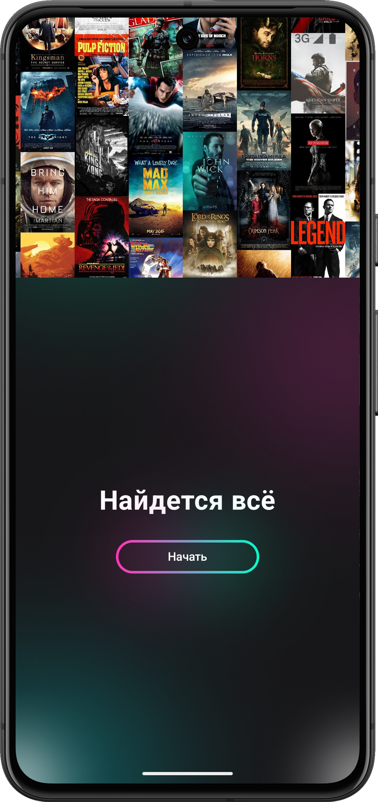
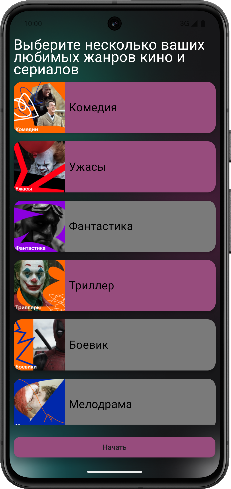
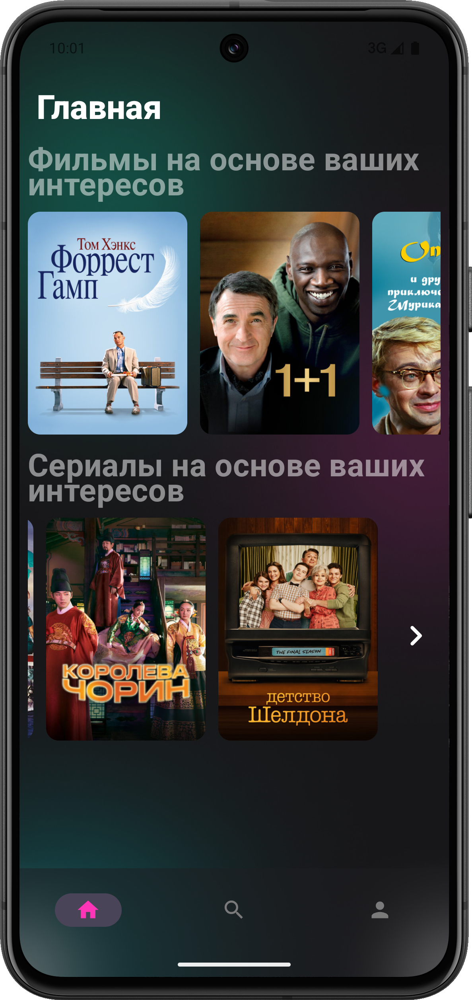
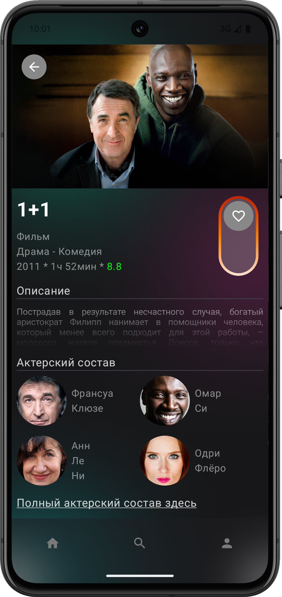
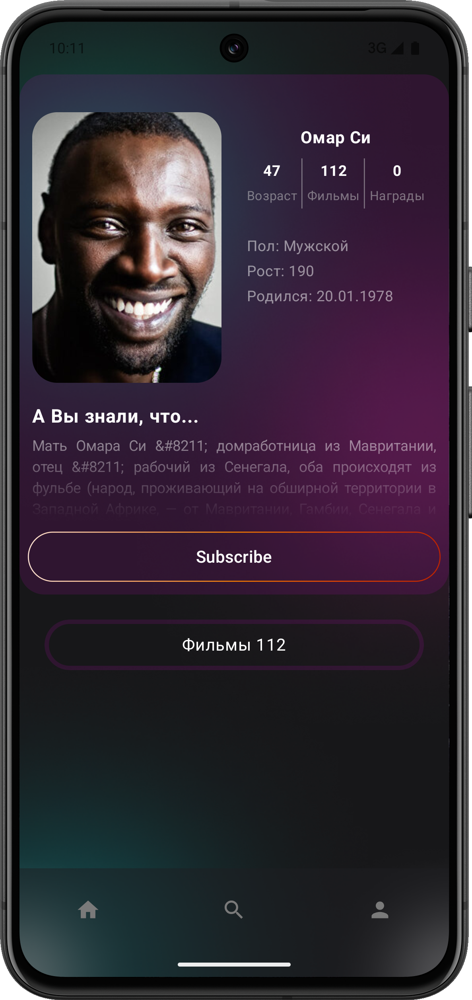
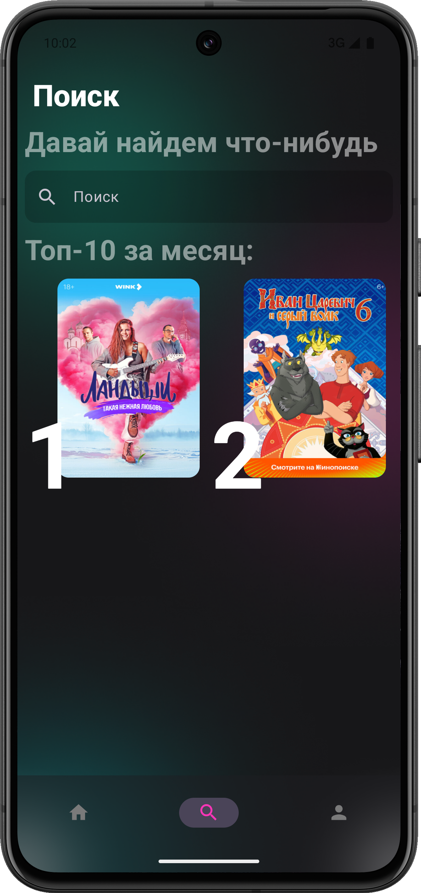
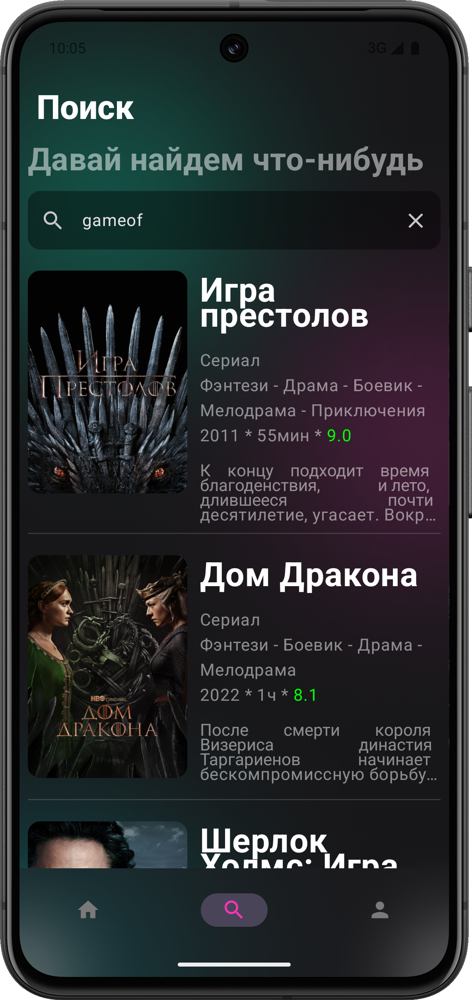
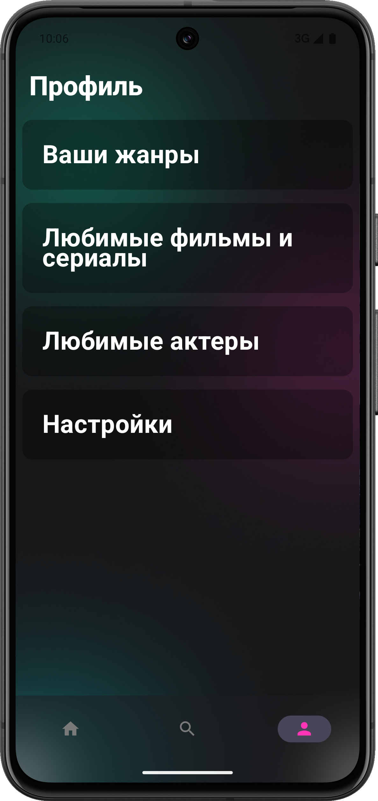
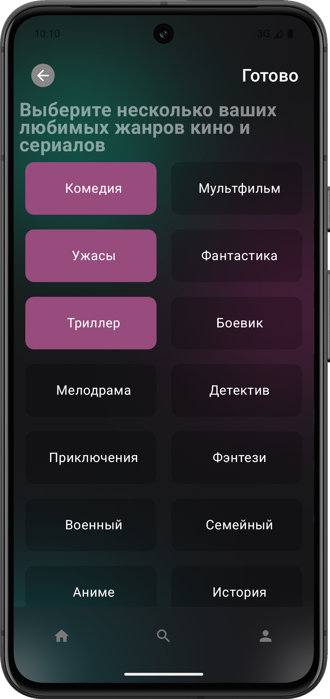
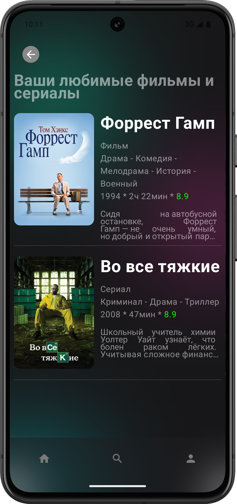

# FrameFusion

**FrameFusion** — это современное приложение для поиска и подбора фильмов и сериалов, созданное с использованием передовых технологий. Мы стремимся предоставить пользователям интуитивно понятный интерфейс и мощные инструменты для поиска, фильтрации и получения информации о любимых фильмах и сериалах.


## Зачем FrameFusion?

В мире, где контент доступен в изобилии, пользователям становится все сложнее находить именно то, что они хотят посмотреть. FrameFusion решает эту проблему, предлагая:

- **Умный поиск**: Используйте мощный поиск по названию, чтобы быстро находить интересующие вас фильмы и сериалы.
- **Персонализированные рекомендации**: Получайте рекомендации на основе ваших предпочтений.
- **Интуитивно понятный интерфейс**: Легкий и современный дизайн, который делает навигацию по приложению простой и приятной.
- **Избранное**: Добавляйте фильмы, сериалы и актеров в избранное, чтобы быстро возвращаться к ним позже.


## Особенности

- **Мгновенный доступ к информации**: Получайте актуальные данные о фильмах и сериалах, включая описание, актерский состав и постеры.
- **Интеграция с популярными API**: FrameFusion использует KinopoiskAPI, для получения самой свежей информации о контенте.
- **Поддержка нескольких языков**: FrameFusion доступен на нескольких языках, что делает его доступным для широкой аудитории.

## Скриншоты

<div class="container" style="display: flex; flex-wrap: nowrap; overflow-x: auto;">
    
    
    
    
    
    
</div>
<div class="container" style="display: flex; flex-wrap: nowrap; overflow-x: auto;">
    
    
    
    
    
</div>


<details>
<summary>
  
## Установка

</summary>

Чтобы установить FrameFusion, выполните следующие шаги:

Клонируйте репозиторий:
```
git clone https://github.com/yourusername/FrameFusion.git
```
